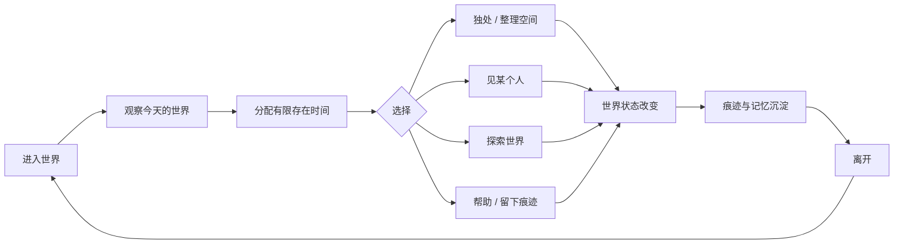

# Finite Presence / 有限存在

> **世界一直都在，而你不能一直都在。**

Finite Presence 是一个“永久世界 + 有限存在时间 + 分层私人空间 + 永久公共领域 + 低压力社交”的游戏概念与可运行原型仓库。

本项目不是以高 DAU、签到、无限刷取或强制社交为核心，而是尝试验证一个更窄、更难但更有辨识度的命题：

> 当玩家每天只有有限的有效存在时间时，他会如何在 **独处、建设、见面、探索、帮助、留下痕迹** 之间做选择？这些选择是否会因为时间有限而更有意义，而不是更焦虑？


## 项目声明

这个项目首先是一个**思想与设计构想**，而不是一份用来展示编程技巧的软件作品。

项目制作者没有编程知识背景。当前仓库中的代码、原型、结构化文档与工程实现，均由 AI 根据制作者提出的思想、判断与持续反馈协助完成。项目的核心命题、价值取向与设计选择来自制作者本人。

制作者希望，每个人都能在有限的时间里，自主选择自己如何存在，把时间留给谁、留给什么，以及什么对自己真正有意义。

> **工作已经够累了，就不要再辛苦做一些自己并不喜欢的事情。**

因此，本项目不希望用签到、日常任务、惩罚性缺席、无限刷取或强制社交去占据玩家的生活。它希望把有限的时间重新交还给玩家，让“选择如何存在”本身成为游戏。

这就是 **Finite Presence / 有限存在** 这个构想的由来。

## 1. 当前状态

- 阶段：`Concept + MVP Prototype`
- 版本：`v0.1.1`
- 目标：验证核心体验，不追求完整游戏内容
- 可运行：是（浏览器静态原型，无外部依赖）
- 推荐下一阶段：用户测试 → 决策指标 → 引擎原型（Godot / Unity）

## 2. 项目核心

### 2.1 四个核心对象

1. **Presence / 存在时间**：玩家每天可主动改变世界的有限时间。
2. **Home / 私人空间**：每个玩家从一开始就拥有永久居所，不靠重度刷资源获取。
3. **Boundary / 空间边界**：居所按访问权限分层；玩家决定陌生人、好友、指定对象分别能进入哪里。
4. **Commons / 公共领域**：每个居所外都必须连接一个永久公共区域，任何玩家都可以进入并进行非破坏性交互。

### 2.2 三句设计总纲

- **时间表达重视。** 我愿意把今天有限的时间给谁。
- **空间表达信任。** 我愿意让谁离我多近。
- **行动表达情感。** 我不必说“我在乎”，可以通过等待、拜访、帮助、留下物品来表达。

## 3. 非目标

本项目当前不追求：

- 连续签到、日常任务、强制日活；
- 高频 Battle Pass、FOMO 型限时活动；
- 战力膨胀；
- 大型公会管理；
- 强制多人组队；
- 资源采集与建造劳动化；
- 以聊天量作为社交活跃指标；
- 用大量煽情台词替代行为设计。

## 4. 核心循环



核心闭环：

**Presence → Choice → Action → Trace → Memory → Return**

## 5. 隐私梯度

建议的默认空间模型：

| 层级 | 名称 | 默认访问对象 | 说明 |
|---|---|---|---|
| L0 | 公共领域 Commons | 所有人 | 永久公共，不可被屋主关闭 |
| L1 | 门前 / 门廊 Threshold | 所有人 | 弱接触、留言、等待 |
| L2 | 会客区 Guest Space | 好友 / 允许访客 | 一般社交 |
| L3 | 熟人区 Trusted Space | 指定关系 | 更高信任 |
| L4 | 私人区 Intimate Space | 明确白名单 | 私人收藏、卧室等 |
| L5 | 核心私域 Self Space | 仅本人 | 日记、核心记忆、私密配置 |

权限必须支持“简单默认模板 + 高级自定义”，避免把玩家变成权限管理员。

## 6. 公共领域原则

公共领域的目的不是强制社交，而是提供 **Ambient Sociality / 环境式社交**：即便玩家完全关闭私人空间，也仍可能看到、听到、感受到其他玩家的存在。

重要边界：

> **Public Access ≠ Unlimited Mutation**

所有玩家都拥有平等进入权和非破坏性交互权，但不能破坏、堵塞、骚扰、跟踪或永久修改他人的私人资产。

## 7. 时间模型

项目固定采用：

- **45 分钟 / 日的有效存在时间**

45 分钟不是可选难度或实验档位，而是当前项目的核心设计约束。

建议采用 **有效存在时间** 而不是强制踢下线：

- 有效时间内：旅行、改变世界、完成重要行为；
- 时间结束后：进入 Rest Mode，可阅读留言、看收藏、轻度交谈、停留，但不继续推进核心世界状态。

当前版本**不累计、不中转、不补偿未使用的有效存在时间**。每天新的自然日重新获得 45 分钟。这样避免“攒时间以后集中刷取”破坏有限存在的意义。

## 8. MVP 需要验证的问题

### H1 — 时间价值
有限存在时间是否提高选择意义，而不是制造焦虑？

### H2 — 非奖励行为
没有金币、经验、签到奖励时，玩家是否仍愿意拜访、等待、留言、帮助和整理私人空间？

### H3 — 空间信任
玩家是否能理解并主动使用“允许某个人进入更深空间”作为关系表达？

### H4 — 公共领域
完全封闭的玩家是否仍能因为公共领域而感到“世界里有人”，且不会感觉被侵犯？

### H5 — 回归意愿
玩家离开后是否产生“过几天想回来看看”的愿望，而不是“怕错过奖励”？

## 9. 运行浏览器原型

无需安装依赖：

```bash
cd prototype
python -m http.server 8000
```

浏览器访问：

```text
http://localhost:8000
```

原型当前用于体验：

- 固定 45 分钟有效存在预算；
- 在“独处、拜访、公共领域、建设”之间分配时间；
- 配置住宅各层访问权限；
- 模拟陌生人、好友与指定对象的访问结果；
- 查看公共领域事件和永久痕迹；
- 观察一次会话结束后生成的“生活记录”。

## 10. 仓库结构

```text
finite-presence-game/
├─ README.md
├─ docs/
│  ├─ 00-vision.md
│  ├─ 01-design-principles.md
│  ├─ 02-core-loop.md
│  ├─ 03-social-spatial-model.md
│  ├─ 04-time-model.md
│  ├─ 05-mvp-prd.md
│  ├─ 06-domain-model.md
│  ├─ 07-telemetry-and-evaluation.md
│  ├─ 08-risks-and-governance.md
│  └─ 09-roadmap.md
├─ prototype/
│  ├─ index.html
│  ├─ styles.css
│  └─ app.js
├─ config/
│  └─ game_rules.json
├─ scripts/
│  └─ validate_config.py
├─ tests/
│  └─ test_game_rules.py
└─ .github/
   ├─ workflows/ci.yml
   └─ ISSUE_TEMPLATE/
```

## 11. 当前最重要的产品判断

这个项目不应该先扩大内容规模。只有在以下三个条件被真实用户验证后，才进入游戏引擎与内容生产：

1. 玩家愿意在有限时间下主动做取舍；
2. 玩家愿意在没有高额奖励时进行低强度社会行为；
3. 玩家愿意因为空间、关系和记忆回来，而不是因为日常任务回来。

## 12. 许可

本仓库当前**未附加开源许可证**。在公开发布前，应明确选择 MIT、Apache-2.0、GPL 或保留全部权利。未添加许可证不等于自动开源授权。
